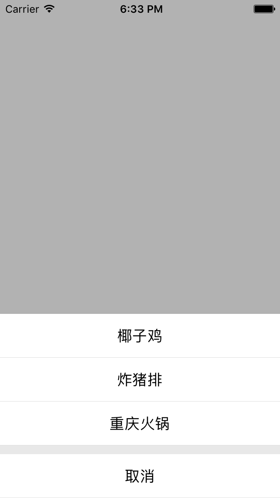

# XWActionSheet

Yet another action sheet for iOS.



## Installation

Add `XWActionSheetView.h` and `XWActionSheetView.m` files to your project.

## Usage

Firstly, import:  `#import "XWActionSheetView.h"`

Secondly, create an action sheet by:

```objective-c
XWActionSheetView *actionSheet = [[XWActionSheetView alloc] initWithTitles:@[@"椰子鸡", @"炸猪排", @"重庆火锅"]];
// Optional
actionSheet.caption = @"今天吃什么";
```

Then, show this view by:

```objective-c
[actionSheet show];
```

Finally, monitor actions by:

```objective-c
[actionSheet observeTapEventWithHandler:^(NSUInteger index, NSString *title, XWActionSheetItemType type) {
    // do something with this info
}];
```

## Demo

Kindly find `XWActionSheet.xcodeproj` project.

## License

The MIT license.

